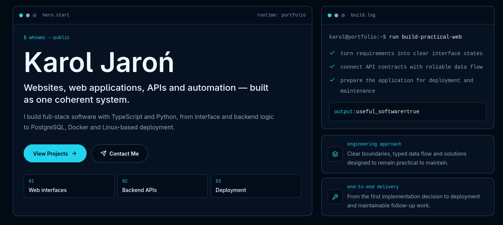

# Portfolio ver.2

Personal portfolio website presenting my experience, selected projects, technical expertise, and software development process.

The website features a responsive, terminal-inspired interface and is available in both English and Polish.

## Features

* Responsive user interface
* English and Polish language support
* Selected projects showcase
* Experience and technical expertise sections
* Software development process overview
* Contact section
* SEO metadata and sitemap
* Schema.org structured data

## Technologies

* Nuxt 4
* Vue 3
* TypeScript
* Tailwind CSS
* Nuxt i18n
* Nuxt SEO
* VueUse
* Lucide Icons

## Live version

[karoljaron.dev](https://karoljaron.dev.hkcode.pl/)

## Author

**Karol Jaroń**
Full-Stack Web Developer

[GitHub](https://github.com/karoljaro)
